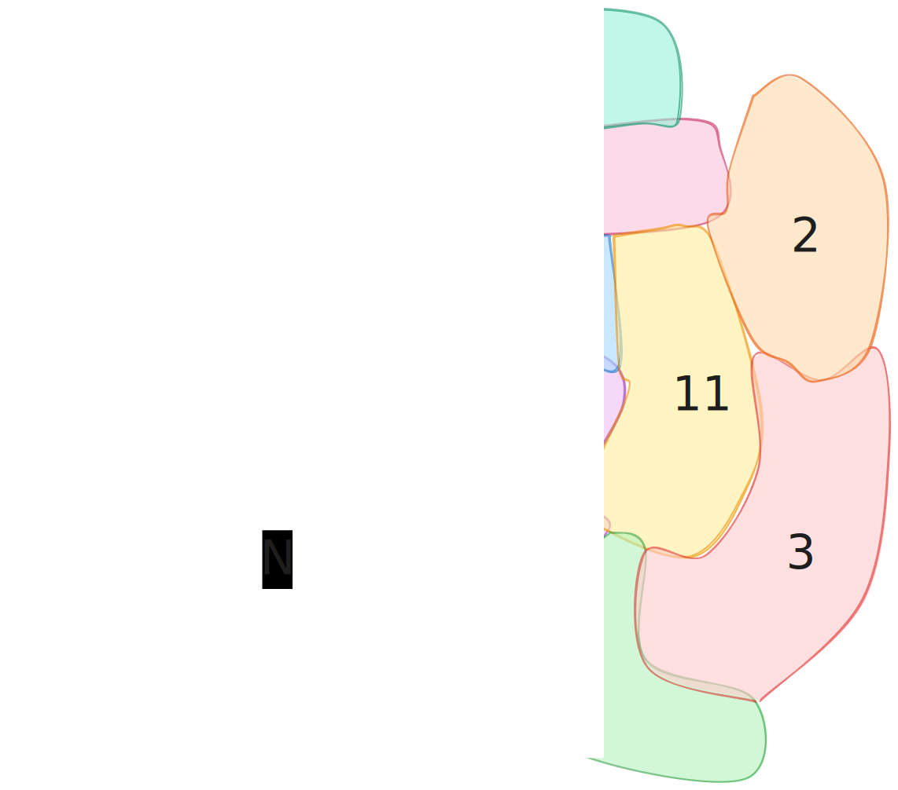
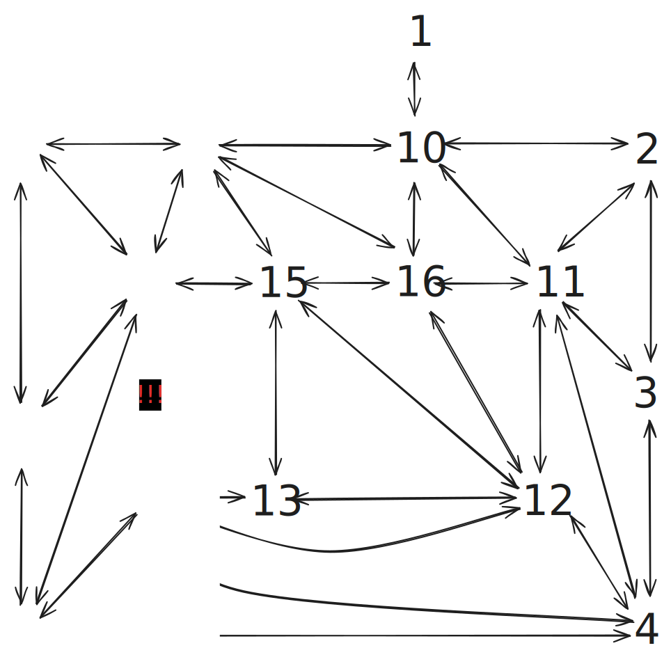

# Background

*[A screenshot taken from "Reksio i Skarb Piratów Remastered Edition"](https://www.przygody-reksia.pl/galeria-zdjec)*

[Reksio](https://en.wikipedia.org/wiki/Reksio) is one of the most popular cartoon character in polish animation industry.   [*Przygody Reksia (Rex Adventures)*](https://reksio.fandom.com/wiki/Przygody_Reksia) is a series of video games based on the animated character. The series is notorious for its relative diffculty, considering its target audience suggested by the game cover (six-year-olds and older children).

One of the puzzles in the first game about Reksio ([Reksio i Skarb Piratów](https://reksio.fandom.com/wiki/Reksio_i_Skarb_Piratów)) struck me as a problem I'd encounter in an AI or algorithm course at a university.

Reksio intents to heat up a paper written with invisible ink in order to decipher it and a minigame for the player ensues. The paper is divided in regions and heating one region heats bordering regions a little bit. If one region is heated too much then it burns and the player is obliged to restart.

# The goal of this repository
I aim to apply my knowledge gained during my computer engeneering degree so far in order to figure out all the possible ways of beating the  Map Heating minigame.
# The Minigame mechanism

*The starting point in the minigame*

*An example intermediate state*

*The goal state*

Here I'll resume what I deduced about the game:
-  the paper is divided in regions
- for clarity let's establish a unit of heating abbreviated as *h* from *heat*
- there are 7 states a region can be in
    1.  0h (a region is not visible)
    2. 0.5h
    3. 1h
    4. 1.5h
    5. 2h (a region is perfectly visibile)
    6. 2.5h (a region is legible, but it's at brink of being burnt out; still acceptable)
    7. 3h (a region is burnt out)
- clicking a region heats up the region being clicked upon by **1h** and its bordering regions by **0.5h**

## Regions and bordering

*The map of paper regions and bordering*

In the map I introduce numbering of regions in a clockwise fashion and going from outer regions to the inner ones.

## The assymetric bordering phenomenon
There's an interesting phenomenon. Heating up the region #5 heats up the region #14, but heating up the region #14 doesn't heat up the region #5. This runs contrary to a sensible implementation of real life physics. 

I marked the assymetric bordering phenomenon on the map with arrows. An arrow with "Y" means "Yes, heating up this region heats up the neighbour" and an arrow with "N" means "No, heating up this region doesn't heat up the neighbour" 

- [ ] Side quest: determine the the reason why the authors opted for this phenomenon

# Coming to a model for this problem

This problem can be represented using the graph theory.

*Regions abstracted away from the minigame*

*An intermediate step in transformation from regions to a graph*

*A graph representation of regions*

An edge from node A to node B means "Heating up node A heats up node B a little, too"

# User Input
A player can influence the game only by clicking regions. The order of clicking doesn't matter. A player can click a particular region:
1. 0 times
2. once
3. twice
4. thrice and more times (if this happens it's sure to produce an unacceptible output - a paper with a hole)

Therefore a node should be thought of as having 3 states (not clicked, clicked once, clicked twice) in further considerations of user input.

The user input can be represented with a vector of length equal to number of verteces in the graph. Each value in the vector should be 0, 1 or 2. The number of possible user input states that may produce an acceptable output is $3^{number \space of \space verteces}$.

In the considered minigame there are 16 nodes. Thus user input ranges from (0,0,0,0,0,0,0,0,0,0,0,0,0,0,0,0) to (2,2,2,2,2,2,2,2,2,2,2,2,2,2,2,2). There are $3^{16} = 43 046 721$. That's a number of candidate solutions modern computers are capable of going through with brute force, therefore further optimizations are not necessary to find out all the solutions. However, I've already come up with some optimizations, so I'll present them there.

# An acceptable solution and a perfect solution
Let's distingush between an acceptable solution and a perfect solution:
- a perefect solution is characterized by having all of its nodes heated up to 2h 
- an acceptable solution is characterized by having all of its nodes heated up to 2h or 2.5h

[//]: # (Let's exclude the perfect solution from acceptable ones for the sake of simplicity in further discussion.)

# Optimizing Brute Force by reducing the solution space
Let's consider heat in the system. There is exactly $2.0 \times number \space of \space verteces$ heat in a perfect solution. There is at least $2.0 \times number \space of \space verteces$ heat in an acceptable solution and there is at most $2.5 \times number \space of \space verteces$ in them.

For example, for the problem presented in *Reksio i Skarb Piratów*:
- There is exactly $2.0 \times 16 = 32$ heat in a perfect solution. 
- There is at least $2.0 \times 16=32$ heat in an acceptable solution and there is at most $2.5 \times 16=40$ in them.

## Upper and lower bounds of clicks
Let's bound the number of clicks possible. Minimum outdegree and maximum outdegree in the graph will play a crucial role.

Clicking a node causes the heat to go up 
- at least by $1 + min \space outdegree * 0.5$
- and at most by  $1 + max \space outdegree * 0.5$
in the system.

The upper bound of number of clicks can be determined by the divison of maximum heat wanted by the minimum heat exerted by a click.

The lower bound of number of clicks can be determined by the divison of minimum heat wanted by the maximum heat exerted by a click.

For example, for the problem presented in *Reksio i Skarb Piratów*:
- for a perefect solution
  - the minimum outdegree is equal to 1 (the region #1)
  - the maximum outdegree is equal to 6 (the regions #11 and #12)
  - There is exactly $2.0 \times 16 = 32$ heat in a perfect solution.
  - The minum amount of heat exerted by a click is $1 + min \space outdegree * 0.5 = 1 + 1 * 0.5 = 1.5$
  - The maximum amount of heat exerted by a click is $1 + max \space outdegree * 0.5 = 1 + 6 * 0.5 = 4.0$
  - The upper bound of number of clicks equals $32 / 1.5=21,33$
  - The lower bound of number of clicks equals $32 / 4.0=8$

- for an acceptable solution
  - the minimum outdegree is equal to 1 (the region #1)
  - the maximum outdegree is equal to 6 (the regions #11 and #12)
  - There is at least $2.0 \times 16=32$ heat in an acceptable solution and there is at most $2.5 \times 16=40$ in them.
  - The minum amount of heat exerted by a click is $1 + min \space outdegree * 0.5 = 1 + 1 * 0.5 = 1.5$
  - The maximum amount of heat exerted by a click is $1 + max \space outdegree * 0.5 = 1 + 6 * 0.5 = 4.0$
  - The upper bound of number of clicks equals $40 / 1.5=26,67$
  - The lower bound of number of clicks equals $32 / 4.0=8$

Since a click can either happen or not and there is no in-between (i.e. it's discrete) some rounding should be considered in the numbers above.

## Expected number of clicks
$The \space number \space of \space clicks =  \frac{wanted \space heat}{1+ \frac{1}{2} \times average \space outdegree}$

In the case of the graph in reksio for the perfect solution it's

$The \space number \space of \space clicks =  \frac{2 \times 16}{1+ \frac{1}{2} \times 4.1875}=10,34$

|Region|Outdegree|
|---|---|
|1|1|
|2|3|
|3|3|
|4|5|
|5|5|
|6|4|
|7|3|
|8|3|
|9|5|
|10|5|
|11|6|
|12|6|
|13|3|
|14|5|
|15|5|
|16|5|

The average is 4.1875. To confirm this hand-made calculation, I made a [js script](auxilary_scripts/outdegreeAvg.js).

## A solution space search based on user input with upper and lower bounds of clicks

The fruit of considerations in this chapter is a solution space search based on user input with upper and lower bounds of clicks.

The space search is reduced to user input represented by vectors, whose sum of elements is between the upper and lower bound. Let's take the classic example of graph present in *Reksio i Skarb Piratów*:
- pure brute force considers 43 046 721 vectors
- brute force enriched by upper and lower bound considers... ??? vectors (for sure it's less than 43 046 721)
  - [ ] calculate the number of vectors

# Code
I've implemented the classic bruteforce method, since my computer goes theough the solution space in about 10 seconds.

# Results

*Visualized solutions*

There are 10 acceptable solutions and 0 perfect solutions. If my program isn't faulty, then achieving the ideal end state suggested by the game is impossible. There'll always be at least one region at brink of burning out.

# Conclusion
Assuming that a player doesn't burn a hole by clicking 3 times a region, but continues to click after burning a hole by other means, then the probability of accedentily stumbling upon one of solutions to this puzzle is equal $\frac{10}{3^{16}}=\frac{10}{43 046 721}\approx0,000000232305731$. In other words: 1 in 4 304 672.

After a failed attempt the narrator in the game says:

> 🇵🇱: Rozumiem, ale wiesz co? To chyba wcale nie jest takie trudne.

> 🏴󠁧󠁢󠁥󠁮󠁧󠁿: I understand, but you know what, I don't think it's that hard at all.

I think this research project makes the quote above look like gaslighting. Poor children.

# Acknowledgments
I want to thank 
- Julia for a beating this game together (we couldn't find a solution to the map heating problem, but the proceedes normally after failing a few times)
- [DeriDreri](https://github.com/DeriDreri) for helping me a little with debuggin C++ (the program unexpectedly copied the graph to Brute Force class instead of passing it directly) and playing  *Reksio i Skarb Piratów Remaster* with me a little bit

# What's next
- [ ] nicen up the formatting of this readme
    - [ ] maybe show an example of heating (from 0h to 3h)
- [X] write about solution space search
  - [X] moves
  - [X] limitations of considered solutions
- [ ] consider the problem from the perspective where the state of the map is the solution space, not the user input
- [X] represent the graph in a computer-friendly way
- [X] implement the brute force method to find the results
- [X] present the results in readme
- [ ] Analyze further the results
- [ ] Consider the corresponding problem in the fan-made remastered edition of *Reksio i Skarb Piratów*